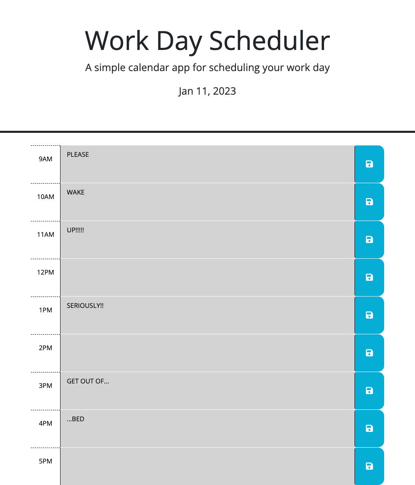

# Work-Day-Scheduler-HW05

## Description 
A daily planner created with HTML, CSS, and JQuery.  Provided with some HTML and CSS starter code, we used JQuery to color code the hour blocks depending on the time of the day,  save the text when clicking the save button,  store the text in local storage,  and keep the text displayed after refreshing the page.

#

## Screenshot: 

#

[THIS IS THE LIVE LINK](https://p0ptartz.github.io/Work-Day-Scheduler-HW05/)